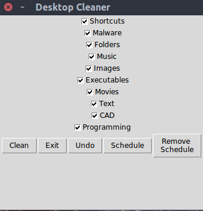

# Thank You

I would like to thank all of the contributors who are improving this project. I appreciate your efforts. This project started when I was in college and I never thought it would turn into anything. Seeing all you guys add features and fix the errors that I couldn't is encouraging. Thank you so much!

# OrganiseDesktop

Takes all the files on your desktop and put them in folders according to extensions. NO MORE MESSY DESKTOPS!
At least not on the outside :)

# Slack Channel invite link

Feel free to join the channel and contribute. If you have already had a PR merged, please join the [channel](https://join.slack.com/t/organisedesktop/shared_invite/enQtMzA2NTI2MTI0MzY4LWRlOWRjOGM0YTJmYjFiZGU3ZTUzM2M0MTA2N2U3MzljMmFhNGIyODlmZDg2N2E1Y2EwOWFiZjcxMzYzYjcyMTk).

# Getting Started

The setup file is not yet configured (work in progress). To run the program, download
the repo and install the required packages then run the `Clean.py` file.

# Technologies Used
Python 3.7  

### Python Libraries Used   ###
beautifulsoup4 - 4.6.0 | certifi - 2018.1.18 | chardet - 3.0.4 | colorama - 0.3.9 | crontab - 0.22.0 |   idna - 2.6 | py-stackexchange - 2.2.7 | requests - 2.18.4  
six - 1.11.0 | urllib3 - 1.22 | urwid - 2.0.1  

# Demo

The buttons are `Clean`, `Exit`, `Undo`, `Schedule`, and `Remove Schedule` and do exactly as they are implied.

`Clean` - will move the files to the correct folder based on the extension. If the folder does not exist, it will create one.  
`Exit` - will close out of the program  
`Undo` - undo where the files were placed in the folders when `Clean`  was used  
`Schedule` - schedules when the program will run every day in the user command line/ terminal  
`Remove Schedule` - removes the previously established schedule

# Prerequisites
### Running a Virtual Environment ###
All the necessary packages are mentioned in `requirements.txt`. They can be installed by running `pip install -r requirements.txt` or using ``pipenv install`` and it will automatically detect the `requirements.txt` and set up an environment for you. For development purposes, I suggest you create a
virtual environment or use a dependency manager like [pipenv](https://github.com/pypa/pipenv) to keep a clear state, separate from your setup.    

To create a virtual environment yourself in pipenv, follow the steps below:  
1. Make a project directory `mkdir project && cd project` where "project" would be the name of the project
2. Initiate the virtual environment `pipenv --three`
3. Start the virtual environment `pipenv shell`  
If the `pipenv install` does not work, insert the following `pipenv install -r requirements.txt`  
4. To exit the virtual environment run `exit`

The `activate.sh` script has been provided to ensure a standard development environment. To create the environment if it doesn't already exist, or simply load it otherwise, run `source ./activate.sh`

You can also use docker in combination with pipenv, [here](https://github.com/dfederschmidt/docker-pipenv-sample) you have an example.
### Not Running from Virtual Environment ###
If you do not want to create a virtual environment, just run the pip command above and ignore the following. Otherwise, the `activate.sh` script will handle the creation and loading of the virtual environment with all the necessary dependencies. Furthermore, once a new dependency is established, remove `requirements.txt` and please run `pip freeze > requirements.txt` to generate a new file that should be committed to version control.

Python3 Instructions:
`python -m venv organise_desktop`

To activate it, run `source organise_desktop/bin/activate`

### Build from Source

`$ git clone https://github.com/blavejr/OrganiseDesktop.git`
Navigate to the repo and run the following command:
`$ pip install -r requirements.txt`

# Contributing
Please read the [Contributing Guidlines](https://github.com/blavejr/OrganiseDesktop/blob/master/CONTRIBUTING.md) for details about pull requests, bug reports, or opening an issue.

Believe in the tech, use the tech, buy a dev coffee.
Btc: 3GiHDAed4UFcE9itaVxQnTrKbW4Uw2kq3o
Ether: 0x14fe9256e1a0d35AB57FdE974E44C1Eaee8005d6
Ltc:MJNKM9SYannnrFuAcMubzEvKBgVPFeBaKm
Bat:0x744de3A9b1882C44dCB3AFD1e6f2dB459b64c45c
USDC:0x8EC9ae0DC0147422c1e9e46124d0BfeE7d16a3e7 
USDC:0x8EC9ae0DC0147422c1e9e46124d0BfeE7d16a3e7
